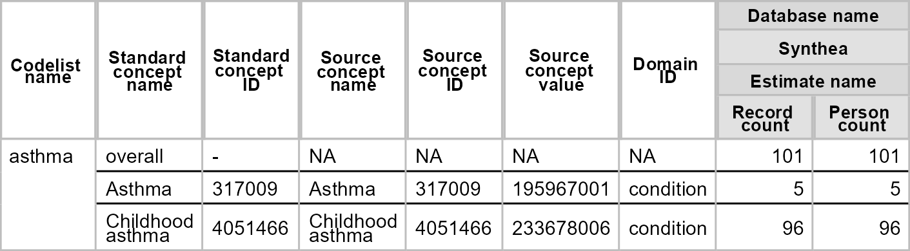

<!-- README.md is generated from README.Rmd. Please edit that file -->

# CodelistGenerator 

<!-- badges: start -->

[](https://CRAN.R-project.org/package=CodelistGenerator)
[](https://app.codecov.io/github/darwin-eu/CodelistGenerator?branch=main)
[](https://github.com/darwin-eu/CodelistGenerator/actions)
[](https://lifecycle.r-lib.org/articles/stages.html#stable)
<!-- badges: end -->

## Installation

You can install CodelistGenerator from CRAN

``` r
install.packages("CodelistGenerator")
```

Or you can also install the development version of CodelistGenerator

``` r
install.packages("remotes")
remotes::install_github("darwin-eu/CodelistGenerator")
```

## Example usage

``` r
library(dplyr)
library(CDMConnector)
library(CodelistGenerator)
```

For this example we’ll use the Eunomia dataset (which only contains a
subset of the OMOP CDM vocabularies)

``` r
requireEunomia()
db <- DBI::dbConnect(duckdb::duckdb(), dbdir = eunomiaDir())
cdm <- cdmFromCon(db, 
                  cdmSchema = "main", 
                  writeSchema = "main", 
                  writePrefix = "cg_")
```

## Exploring the OMOP CDM Vocabulary tables

OMOP CDM vocabularies are frequently updated, and we can identify the
version of the vocabulary of our Eunomia data

``` r
getVocabVersion(cdm = cdm)
#> [1] "v5.0 18-JAN-19"
```

## Vocabulary based codelists using CodelistGenerator

CodelistGenerator provides functions to extract code lists based on
vocabulary hierarchies. One example is \`getDrugIngredientCodes, which
we can use, for example, to get the concept IDs used to represent
aspirin and diclofenac.

``` r
ing <- getDrugIngredientCodes(cdm = cdm, 
                       name = c("aspirin", "diclofenac"),
                       nameStyle = "{concept_name}")
ing
#> 
#> - aspirin (2 codes)
#> - diclofenac (1 codes)
ing$aspirin
#> [1] 19059056  1112807
ing$diclofenac
#> [1] 1124300
```

## Systematic search using CodelistGenerator

CodelistGenerator can also support systematic searches of the vocabulary
tables to support codelist development. A little like the process for a
systematic review, the idea is that for a specified search strategy,
CodelistGenerator will identify a set of concepts that may be relevant,
with these then being screened to remove any irrelevant codes by
clinical experts.

We can do a simple search for asthma

``` r
asthma_codes1 <- getCandidateCodes(
  cdm = cdm,
  keywords = "asthma",
  domains = "Condition"
) 
asthma_codes1 |> 
  glimpse()
#> Rows: 2
#> Columns: 6
#> $ concept_id       <int> 4051466, 317009
#> $ found_from       <chr> "From initial search", "From initial search"
#> $ concept_name     <chr> "Childhood asthma", "Asthma"
#> $ domain_id        <chr> "Condition", "Condition"
#> $ vocabulary_id    <chr> "SNOMED", "SNOMED"
#> $ standard_concept <chr> "S", "S"
```

But perhaps we want to exclude certain concepts as part of the search
strategy, in this case we can add these like so

``` r
asthma_codes2 <- getCandidateCodes(
  cdm = cdm,
  keywords = "asthma",
  exclude = "childhood",
  domains = "Condition"
) 
asthma_codes2 |> 
  glimpse()
#> Rows: 1
#> Columns: 6
#> $ concept_id       <int> 317009
#> $ found_from       <chr> "From initial search"
#> $ concept_name     <chr> "Asthma"
#> $ domain_id        <chr> "Condition"
#> $ vocabulary_id    <chr> "SNOMED"
#> $ standard_concept <chr> "S"
```

## Summarising code use

As well as functions for finding codes, we also have functions to
summarise their use. Here for

``` r
library(flextable)
asthma_code_use <- summariseCodeUse(list("asthma" = asthma_codes1$concept_id),
  cdm = cdm
)
tableCodeUse(asthma_code_use, type = "flextable")
```


