# Generate a candidate codelist

In this example we will create a candidate codelist for osteoarthritis,
exploring how different search strategies may impact our final codelist.
First, let’s load the necessary packages and create a cdm reference
using mock data.

``` r
library(dplyr)
library(CodelistGenerator)

cdm <- mockVocabRef()
```

The mock data has the following hypothetical concepts and relationships:

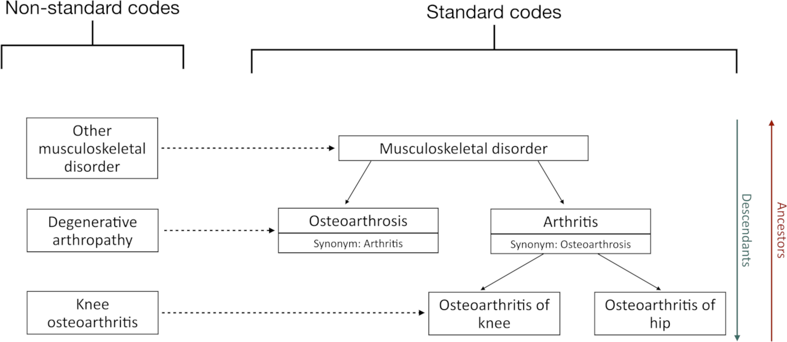

## Search for keyword match

We will start by creating a codelist with keywords match. Let’s say that
we want to find those codes that contain “Musculoskeletal disorder” in
their concept_name: 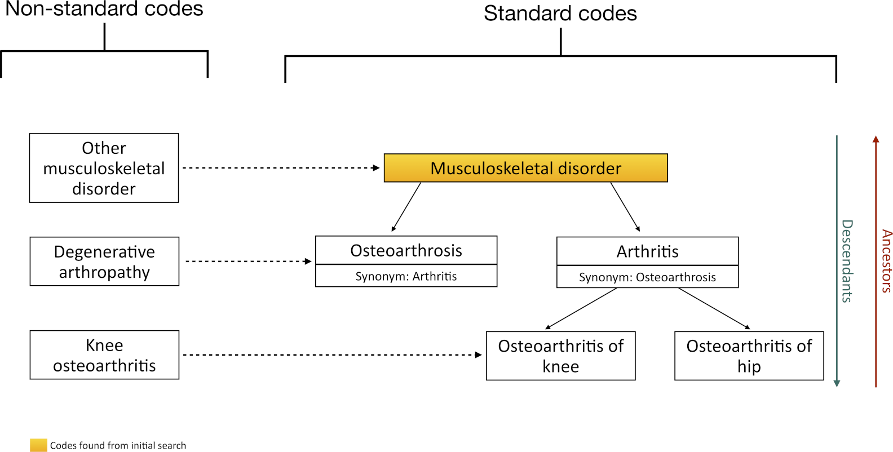

``` r
getCandidateCodes(
  cdm = cdm,
  keywords = "Musculoskeletal disorder",
  domains = "Condition", 
  standardConcept = "Standard",
  includeDescendants = FALSE,
  searchInSynonyms = FALSE,
  searchNonStandard = FALSE,
  includeAncestor = FALSE
)
#> # A tibble: 1 × 6
#>   concept_id found_from    concept_name domain_id vocabulary_id standard_concept
#>        <int> <chr>         <chr>        <chr>     <chr>         <chr>           
#> 1          1 From initial… Musculoskel… Condition SNOMED        S
```

Note that we could also identify it based on a partial match or based on
all combinations match.

``` r
getCandidateCodes(
  cdm = cdm,
  keywords = "Musculoskeletal",
  domains = "Condition",
  standardConcept = "Standard",
  searchInSynonyms = FALSE,
  searchNonStandard = FALSE,
  includeDescendants = FALSE,
  includeAncestor = FALSE
)
#> # A tibble: 1 × 6
#>   concept_id found_from    concept_name domain_id vocabulary_id standard_concept
#>        <int> <chr>         <chr>        <chr>     <chr>         <chr>           
#> 1          1 From initial… Musculoskel… Condition SNOMED        S

getCandidateCodes(
  cdm = cdm,
  keywords = "Disorder musculoskeletal",
  domains = "Condition",
  standardConcept = "Standard",
  searchInSynonyms = FALSE,
  searchNonStandard = FALSE,
  includeDescendants = FALSE,
  includeAncestor = FALSE
)
#> # A tibble: 1 × 6
#>   concept_id found_from    concept_name domain_id vocabulary_id standard_concept
#>        <int> <chr>         <chr>        <chr>     <chr>         <chr>           
#> 1          1 From initial… Musculoskel… Condition SNOMED        S
```

Notice that currently we are only looking for concepts with
`domain = "Condition"`. However, we can expand the search to all domains
using `domain = NULL`.

[`getCandidateCodes()`](https://darwin-eu.github.io/CodelistGenerator/reference/getCandidateCodes.md)
function will generate a table with class “candidate_codes”, which
contains an atribute with the details of the search strategy:

``` r
candidate_codes <- getCandidateCodes(
  cdm = cdm,
  keywords = "Musculoskeletal",
  domains = "Condition",
  standardConcept = "Standard",
  searchInSynonyms = FALSE,
  searchNonStandard = FALSE,
  includeDescendants = FALSE,
  includeAncestor = FALSE
)

searchStrategy(candidate_codes)
#> # A tibble: 1 × 10
#>   cdm_name vocabulary_version keywords          exclude domains standard_concept
#>   <chr>    <chr>              <chr>             <chr>   <chr>   <chr>           
#> 1 mock     v5.0 22-JUN-22     "\"Musculoskelet… "\"\""  "\"con… "\"Standard\""  
#> # ℹ 4 more variables: search_in_synonyms <lgl>, search_non_standard <lgl>,
#> #   include_descendants <lgl>, include_ancestor <lgl>
```

## Include non-standard concepts

Now we will include standard and non-standard concepts in our initial
search. By setting `standardConcept = c("Non-standard", "Standard")`, we
allow the function to return, in the final candidate codelist, both the
non-standard and standard codes that have been found.

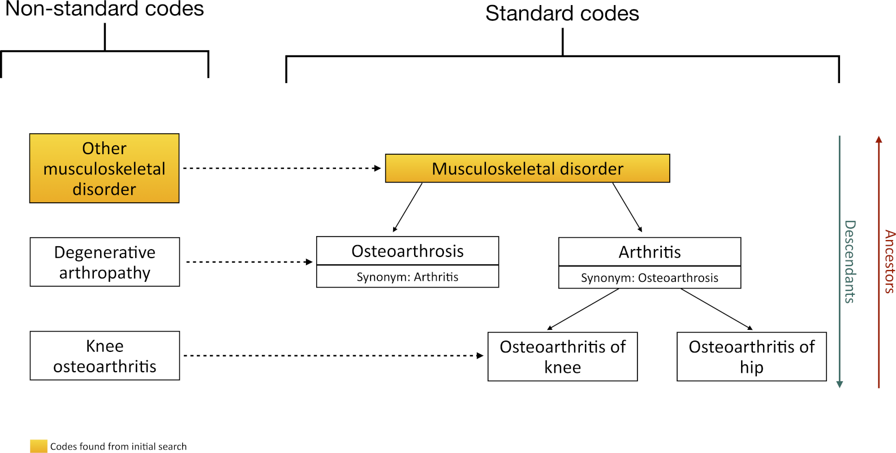

``` r
getCandidateCodes(
  cdm = cdm,
  keywords = "Musculoskeletal disorder",
  domains = "Condition",
  standardConcept = c("Non-standard", "Standard"),
  searchInSynonyms = FALSE,
  searchNonStandard = FALSE,
  includeDescendants = FALSE,
  includeAncestor = FALSE
)
#> # A tibble: 2 × 6
#>   concept_id found_from    concept_name domain_id vocabulary_id standard_concept
#>        <int> <chr>         <chr>        <chr>     <chr>         <chr>           
#> 1          1 From initial… Musculoskel… Condition SNOMED        S               
#> 2         24 From initial… Other muscu… Condition SNOMED        NA
```

## Multiple search terms

We can also search for multiple keywords simultaneously, capturing all
of them with the following search:

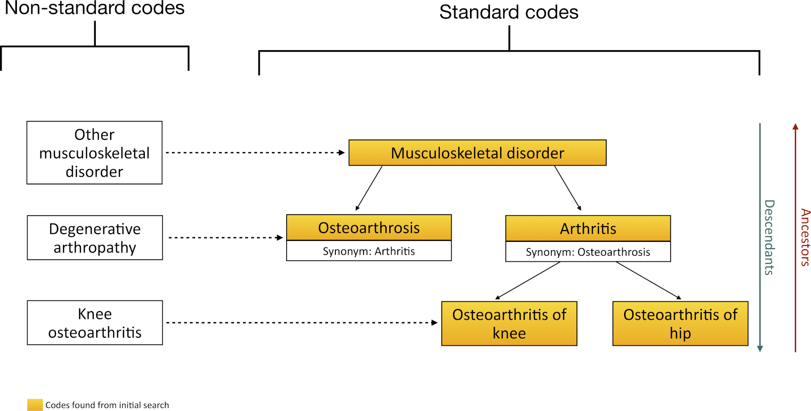

``` r
getCandidateCodes(
  cdm = cdm,
  keywords = c(
    "Musculoskeletal disorder",
    "arthritis"
  ),
  domains = "Condition",
  standardConcept = c("Standard"),
  includeDescendants = FALSE,
  searchInSynonyms = FALSE,
  searchNonStandard = FALSE,
  includeAncestor = FALSE
)
#> # A tibble: 4 × 6
#>   concept_id found_from    concept_name domain_id vocabulary_id standard_concept
#>        <int> <chr>         <chr>        <chr>     <chr>         <chr>           
#> 1          1 From initial… Musculoskel… Condition SNOMED        S               
#> 2          3 From initial… Arthritis    Condition SNOMED        S               
#> 3          4 From initial… Osteoarthri… Condition SNOMED        S               
#> 4          5 From initial… Osteoarthri… Condition SNOMED        S
```

## Add descendants

Now we will include the descendants of an identified code using
`includeDescendants` argument 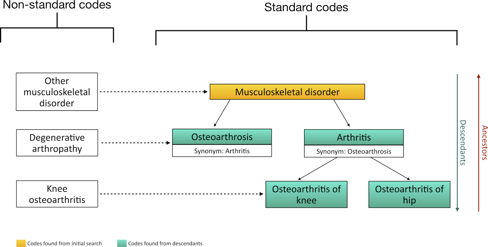

``` r
getCandidateCodes(
  cdm = cdm,
  keywords = "Musculoskeletal disorder",
  domains = "Condition",
  standardConcept = "Standard",
  includeDescendants = TRUE,
  searchInSynonyms = FALSE,
  searchNonStandard = FALSE,
  includeAncestor = FALSE
)
#> # A tibble: 5 × 6
#>   concept_id found_from    concept_name domain_id vocabulary_id standard_concept
#>        <int> <chr>         <chr>        <chr>     <chr>         <chr>           
#> 1          1 From initial… Musculoskel… Condition SNOMED        S               
#> 2          2 From descend… Osteoarthro… Condition SNOMED        S               
#> 3          3 From descend… Arthritis    Condition SNOMED        S               
#> 4          4 From descend… Osteoarthri… Condition SNOMED        S               
#> 5          5 From descend… Osteoarthri… Condition SNOMED        S
```

Notice that now, in the column `found_from`, we can see that we have
obtain `concept_id=1` from an initial search, and
`concept_id_=c(2,3,4,5)` when searching for descendants of concept_id 1.

## With exclusions

We can also exclude specific keywords using the argument `exclude`

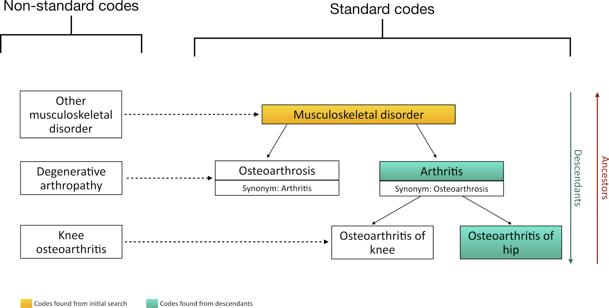

``` r
getCandidateCodes(
  cdm = cdm,
  keywords = "Musculoskeletal disorder",
  domains = "Condition",
  exclude = c("Osteoarthrosis", "knee"),
  standardConcept = "Standard",
  includeDescendants = TRUE,
  searchInSynonyms = FALSE,
  searchNonStandard = FALSE,
  includeAncestor = FALSE
)
#> # A tibble: 3 × 6
#>   concept_id found_from    concept_name domain_id vocabulary_id standard_concept
#>        <int> <chr>         <chr>        <chr>     <chr>         <chr>           
#> 1          1 From initial… Musculoskel… Condition SNOMED        S               
#> 2          3 From descend… Arthritis    Condition SNOMED        S               
#> 3          5 From descend… Osteoarthri… Condition SNOMED        S
```

When multiple words are added within a term (e.g., “knee
osteoarthritis”), each word will be searched independently, so that for
example, “osteoarthritis of knee” is excluded:

``` r
getCandidateCodes(
  cdm = cdm,
  keywords = "Musculoskeletal disorder",
  domains = "Condition",
  exclude = c("knee osteoarthritis"),
  standardConcept = "Standard",
  includeDescendants = TRUE,
  searchInSynonyms = FALSE,
  searchNonStandard = FALSE,
  includeAncestor = FALSE
)
#> # A tibble: 4 × 6
#>   concept_id found_from    concept_name domain_id vocabulary_id standard_concept
#>        <int> <chr>         <chr>        <chr>     <chr>         <chr>           
#> 1          1 From initial… Musculoskel… Condition SNOMED        S               
#> 2          2 From descend… Osteoarthro… Condition SNOMED        S               
#> 3          3 From descend… Arthritis    Condition SNOMED        S               
#> 4          5 From descend… Osteoarthri… Condition SNOMED        S
```

If we only want to exclude exact matching terms (without accounting for
words boundaries) we need to add “/” at the beginning and at the end of
the term. Hence, using “knee osteoarthritis”, “osteoarthritis of knee”
**won’t** be excluded. However, if we had “rightknee osteoarthritis”, it
would be excluded.

``` r
# No exclusion:
getCandidateCodes(
    cdm = cdm,
    keywords = "Knee",
    domains = "Condition",
    exclude = NULL,
    standardConcept = c("Standard", "Non-standard"),
    includeDescendants = TRUE,
    searchInSynonyms = FALSE,
    searchNonStandard = FALSE,
    includeAncestor = FALSE
)
#> # A tibble: 2 × 6
#>   concept_id found_from    concept_name domain_id vocabulary_id standard_concept
#>        <int> <chr>         <chr>        <chr>     <chr>         <chr>           
#> 1          4 From initial… Osteoarthri… Condition SNOMED        S               
#> 2          8 From initial… Knee osteoa… Condition Read          NA

# Exclusion looking for terms:
getCandidateCodes(
  cdm = cdm,
  keywords = "Knee",
  domains = "Condition",
  exclude = c("knee osteoarthritis"),
  standardConcept = c("Standard", "Non-standard"),
  includeDescendants = TRUE,
  searchInSynonyms = FALSE,
  searchNonStandard = FALSE,
  includeAncestor = FALSE
)
#> # A tibble: 0 × 7
#> # ℹ 7 variables: concept_id <int>, found_from <chr>, found_id <int>,
#> #   concept_name <chr>, domain_id <chr>, vocabulary_id <chr>,
#> #   standard_concept <chr>

# Exclusion looking for partial matching terms (without word boundaries)
getCandidateCodes(
  cdm = cdm,
  keywords = "Knee",
  domains = "Condition",
  exclude = c("/knee osteoarthritis/"),
  standardConcept = c("Standard", "Non-standard"),
  includeDescendants = TRUE,
  searchInSynonyms = FALSE,
  searchNonStandard = FALSE,
  includeAncestor = FALSE
)
#> # A tibble: 1 × 6
#>   concept_id found_from    concept_name domain_id vocabulary_id standard_concept
#>        <int> <chr>         <chr>        <chr>     <chr>         <chr>           
#> 1          4 From initial… Osteoarthri… Condition SNOMED        S

# Exclusion looking for partial matching terms (without word boundaries)
getCandidateCodes(
  cdm = cdm,
  keywords = "Knee",
  domains = "Condition",
  exclude = c("/e osteoarthritis/"),
  standardConcept = c("Standard", "Non-standard"),
  includeDescendants = TRUE,
  searchInSynonyms = FALSE,
  searchNonStandard = FALSE,
  includeAncestor = FALSE
)
#> # A tibble: 1 × 6
#>   concept_id found_from    concept_name domain_id vocabulary_id standard_concept
#>        <int> <chr>         <chr>        <chr>     <chr>         <chr>           
#> 1          4 From initial… Osteoarthri… Condition SNOMED        S
```

If we want to do exact matching (that means, to find the exact two words
“knee osteoarthritis” in the concept name) we need to use “/ at the
beginning and at the end of the expression.

``` r
getCandidateCodes(
  cdm = cdm,
  keywords = "Knee",
  domains = "Condition",
  exclude = c("/\bKnee osteoarthritis/\b"),
  standardConcept = c("Standard", "Non-standard"),
  includeDescendants = TRUE,
  searchInSynonyms = FALSE,
  searchNonStandard = FALSE,
  includeAncestor = FALSE
)
#> # A tibble: 1 × 6
#>   concept_id found_from    concept_name domain_id vocabulary_id standard_concept
#>        <int> <chr>         <chr>        <chr>     <chr>         <chr>           
#> 1          4 From initial… Osteoarthri… Condition SNOMED        S

# We will now only search for "ee osteoarthritis" to show that 
# "knee osteoarthritis" won't be excluded:
getCandidateCodes(
  cdm = cdm,
  keywords = "Knee",
  domains = "Condition",
  exclude = c("/\bee osteoarthritis/\b"),
  standardConcept = c("Standard", "Non-standard"),
  includeDescendants = TRUE,
  searchInSynonyms = FALSE,
  searchNonStandard = FALSE,
  includeAncestor = FALSE
)
#> # A tibble: 2 × 6
#>   concept_id found_from    concept_name domain_id vocabulary_id standard_concept
#>        <int> <chr>         <chr>        <chr>     <chr>         <chr>           
#> 1          4 From initial… Osteoarthri… Condition SNOMED        S               
#> 2          8 From initial… Knee osteoa… Condition Read          NA
```

    For example, if we look for 

    Notice that, for example, if we wanted `keywords = "depression"` and `exclude = "ST depression"`, concepts like "poSTpartum depression" would be excluded. To avoid this,
    we could use `exclude = "/ST depression/"`. Notice that, "poST depression" would also be excluded with this option.

    Hence, there is another option to exclude exact matching terms accounting for words boundaries: adding "/\b" at the beginning and at the end of the term. For example, if we look for "/\bp osteoarthritis/\b", concepts like "hip osteoarthritis **won't** be excluded.


    ## Add ancestor
    To include the ancestors one level above the identified concepts, we can use the argument `includeAncestor`
    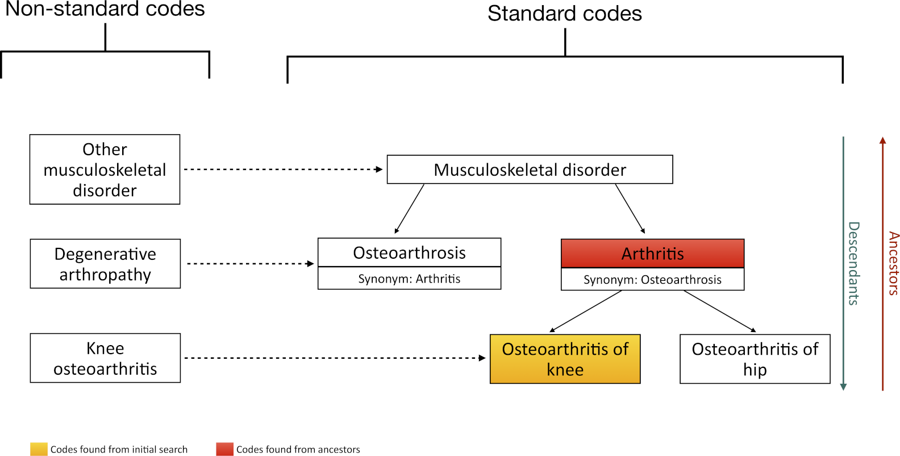


    ``` r
    codes <- getCandidateCodes(
      cdm = cdm,
      keywords = "Osteoarthritis of knee",
      includeAncestor = TRUE,
      domains = "Condition",
      standardConcept = "Standard",
      includeDescendants = TRUE,
      searchInSynonyms = FALSE,
      searchNonStandard = FALSE,
    )

    codes
    #> 
[38;5;246m# A tibble: 2 × 6
[39m
    #>   concept_id found_from    concept_name domain_id vocabulary_id standard_concept
    #>        
[3m
[38;5;246m<int>
[39m
[23m 
[3m
[38;5;246m<chr>
[39m
[23m         
[3m
[38;5;246m<chr>
[39m
[23m        
[3m
[38;5;246m<chr>
[39m
[23m     
[3m
[38;5;246m<chr>
[39m
[23m         
[3m
[38;5;246m<chr>
[39m
[23m           
    #> 
[38;5;250m1
[39m          3 From ancestor Arthritis    Condition SNOMED        S               
    #> 
[38;5;250m2
[39m          4 From initial… Osteoarthri… Condition SNOMED        S

## Search using synonyms

We can also pick up codes based on their synonyms. For example,
**Osteoarthrosis** has a synonym of **Arthritis**. 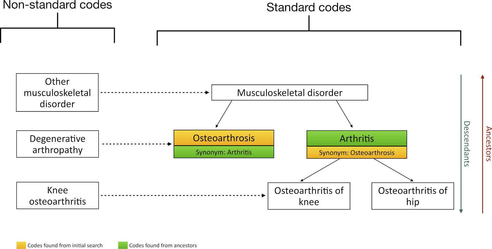

``` r
getCandidateCodes(
  cdm = cdm,
  keywords = "osteoarthrosis",
  domains = "Condition",
  searchInSynonyms = TRUE,
  standardConcept = "Standard",
  includeDescendants = FALSE,
  searchNonStandard = FALSE,
  includeAncestor = FALSE
)
#> # A tibble: 2 × 6
#>   concept_id found_from    concept_name domain_id vocabulary_id standard_concept
#>        <int> <chr>         <chr>        <chr>     <chr>         <chr>           
#> 1          2 From initial… Osteoarthro… Condition SNOMED        S               
#> 2          3 In synonyms   Arthritis    Condition SNOMED        S
```

Notice that if `includeDescendants = TRUE`, **Arthritis** descendants
will also be included: 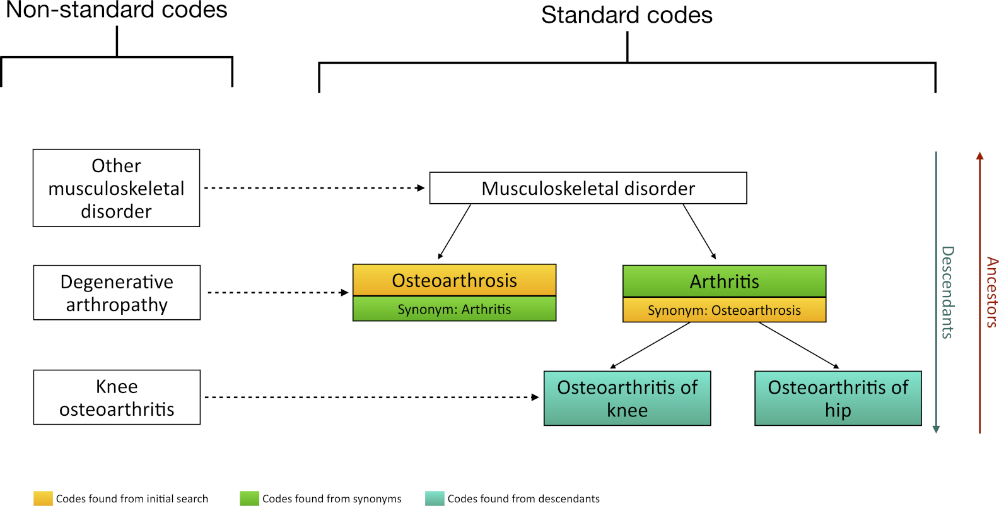

``` r
getCandidateCodes(
  cdm = cdm,
  keywords = "osteoarthrosis",
  domains = "Condition",
  searchInSynonyms = TRUE,
  standardConcept = "Standard",
  includeDescendants = TRUE,
  searchNonStandard = FALSE,
  includeAncestor = FALSE
)
#> # A tibble: 4 × 6
#>   concept_id found_from    concept_name domain_id vocabulary_id standard_concept
#>        <int> <chr>         <chr>        <chr>     <chr>         <chr>           
#> 1          2 From initial… Osteoarthro… Condition SNOMED        S               
#> 2          3 In synonyms   Arthritis    Condition SNOMED        S               
#> 3          4 From descend… Osteoarthri… Condition SNOMED        S               
#> 4          5 From descend… Osteoarthri… Condition SNOMED        S
```

## Search via non-standard

We can also pick up concepts associated with our keyword via
non-standard search. 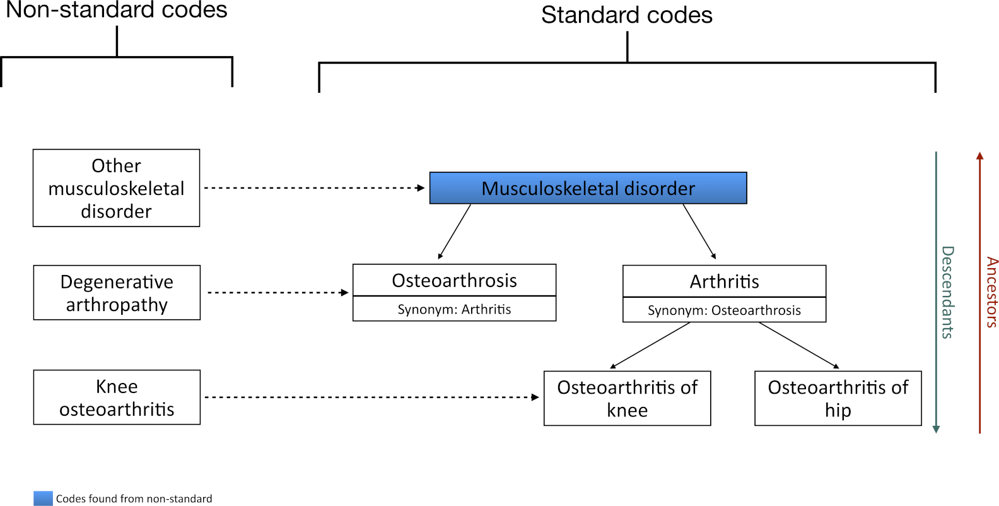

``` r
codes1 <- getCandidateCodes(
  cdm = cdm,
  keywords = "Degenerative",
  domains = "Condition",
  standardConcept = "Standard",
  searchNonStandard = TRUE,
  includeDescendants = FALSE,
  searchInSynonyms = FALSE,
  includeAncestor = FALSE
)
codes1
#> # A tibble: 1 × 6
#>   concept_id found_from    concept_name domain_id vocabulary_id standard_concept
#>        <int> <chr>         <chr>        <chr>     <chr>         <chr>           
#> 1          2 From non-sta… Osteoarthro… Condition SNOMED        S
```

Let’s take a moment to focus on the `standardConcept` and
`searchNonStandard` arguments to clarify the difference between them.
`standardConcept` specifies whether we want only standard concepts or
also include non-standard concepts in the final candidate codelist.
`searchNonStandard` determines whether we want to search for keywords
among non-standard concepts.

In the previous example, since we set `standardConcept = "Standard"`, we
retrieved the code for **Osteoarthrosis** from the non-standard search.
However, we did not obtain the non-standard code **degenerative
arthropathy** from the initial search. If we allow non-standard concepts
in the final candidate codelist, we would retireve both codes:

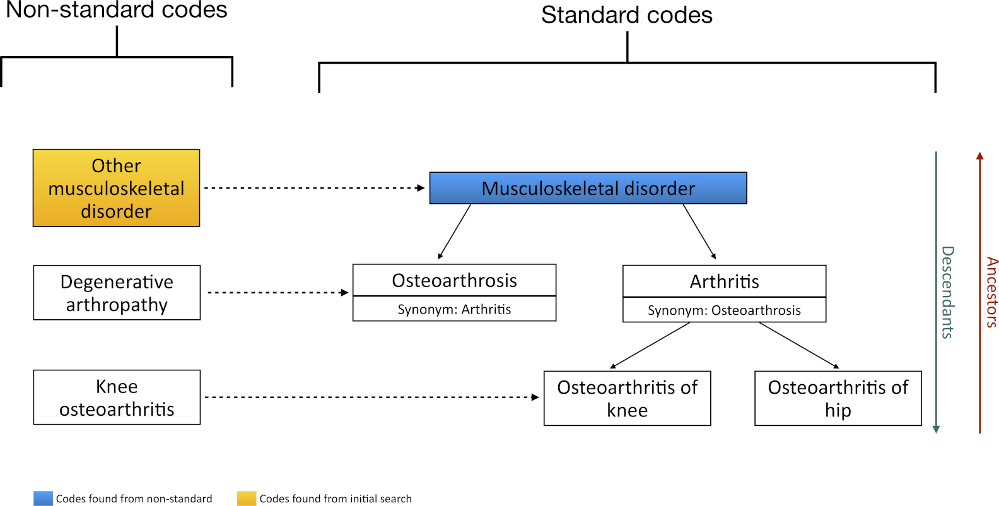

``` r
codes2 <- getCandidateCodes(
  cdm = cdm,
  keywords = "Degenerative",
  domains = "Condition",
  standardConcept = c("Non-standard", "Standard"),
  searchNonStandard = FALSE,
  includeDescendants = FALSE,
  searchInSynonyms = FALSE,
  includeAncestor = FALSE
)
codes2
#> # A tibble: 1 × 6
#>   concept_id found_from    concept_name domain_id vocabulary_id standard_concept
#>        <int> <chr>         <chr>        <chr>     <chr>         <chr>           
#> 1          7 From initial… Degenerativ… Condition Read          NA
```
