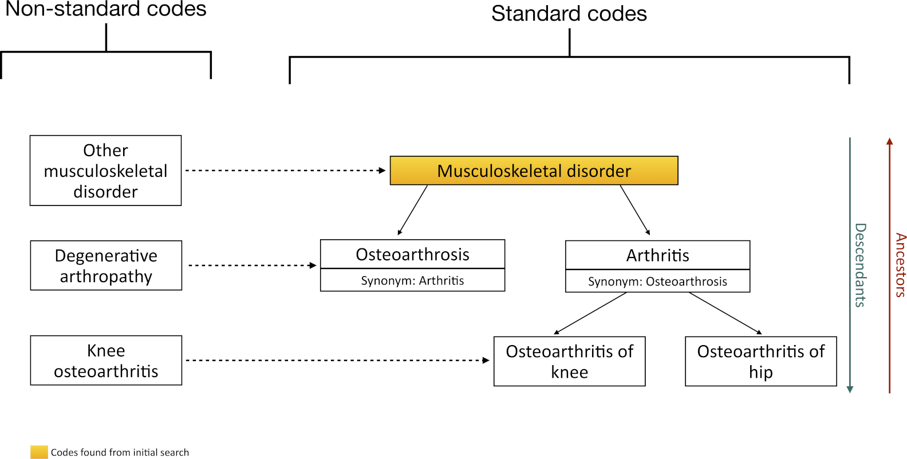
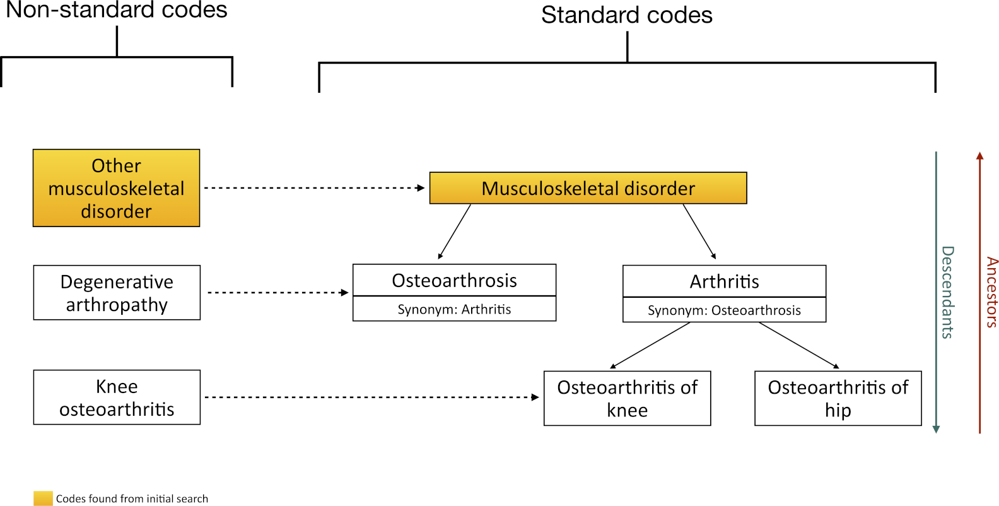
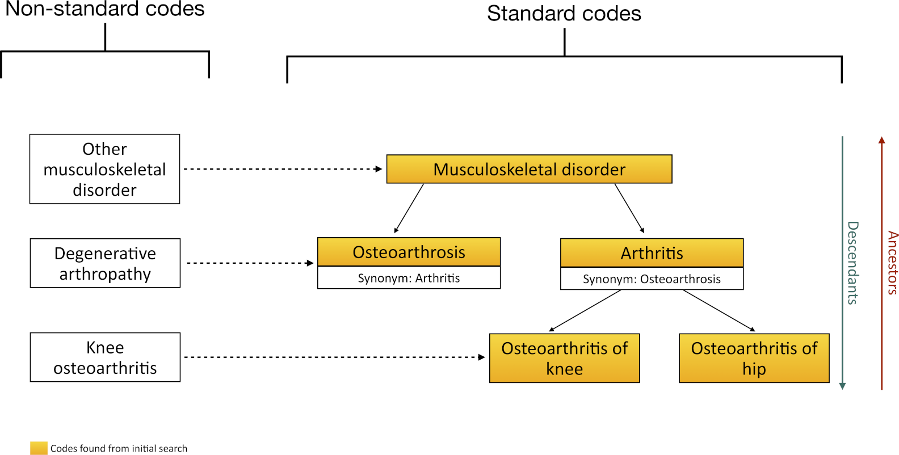
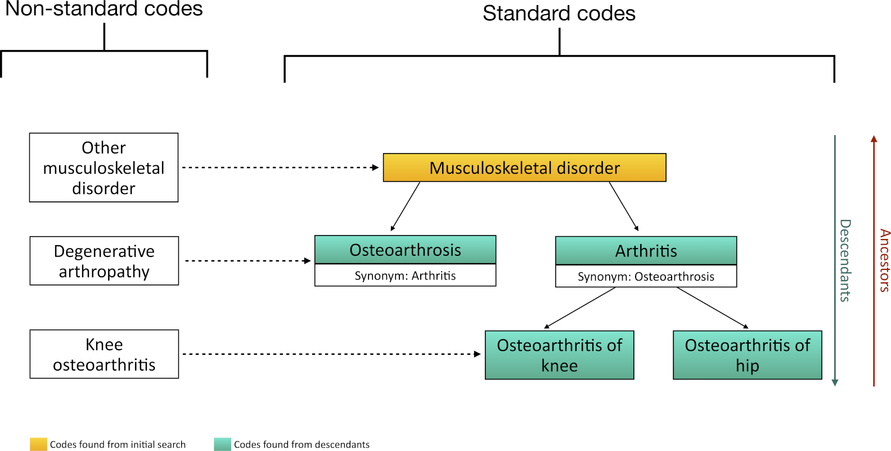
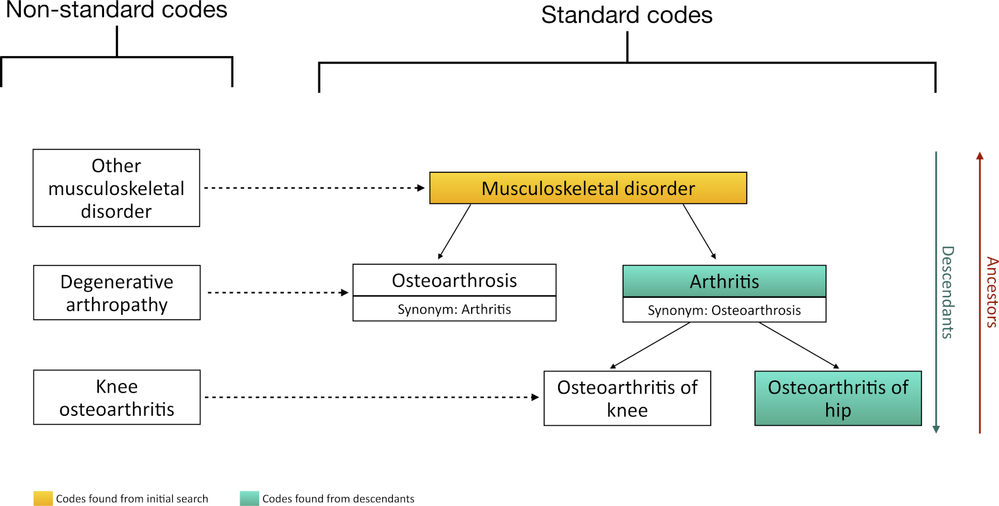
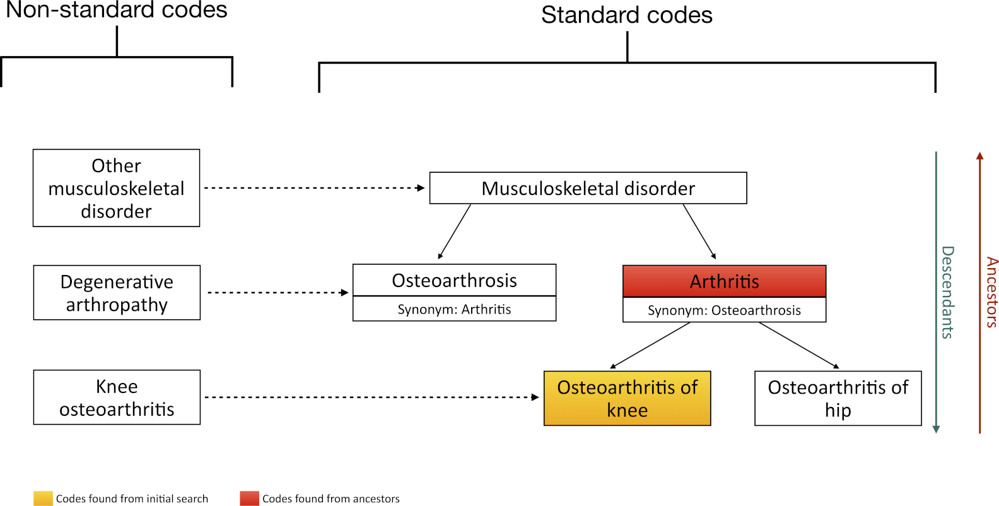
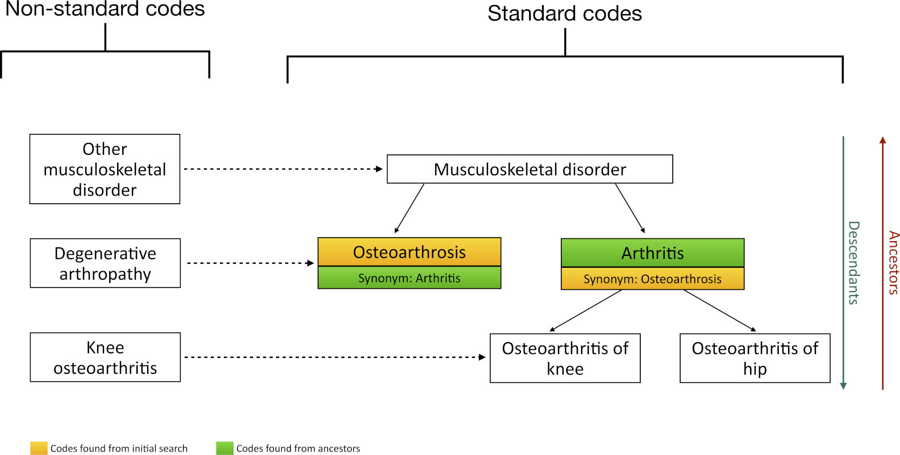
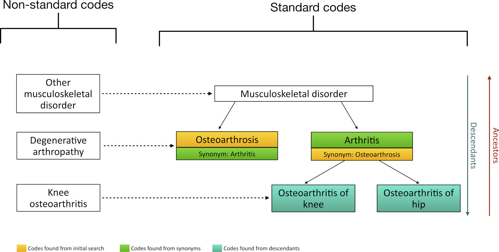
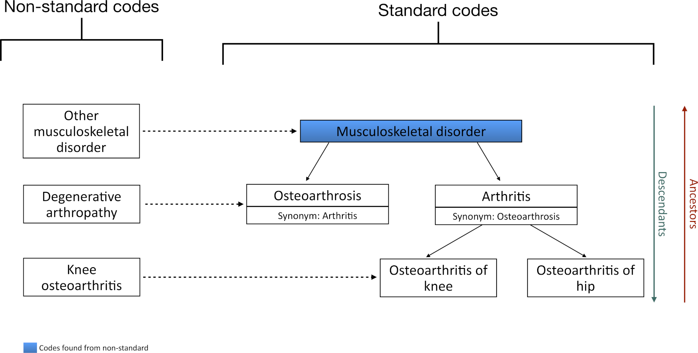
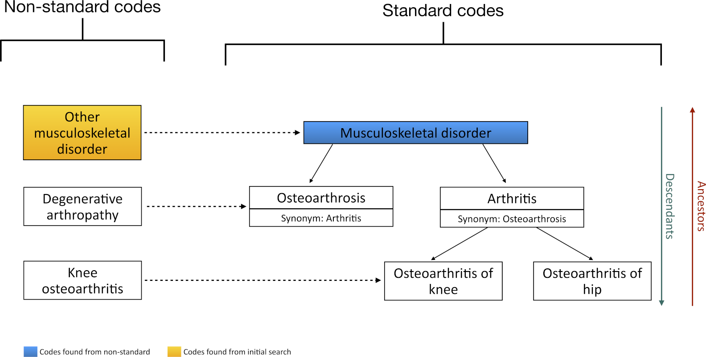

```{r, include = FALSE}
knitr::opts_chunk$set(
  collapse = TRUE,
  comment = "#>",
  out.width = "100%"
)
```

In this example we will create a candidate codelist for osteoarthritis, exploring how different search strategies may impact our final codelist. 
First, let's load the necessary packages and create a cdm reference using mock data.

```{r,  message=FALSE, warning=FALSE}
library(dplyr)
library(CodelistGenerator)

cdm <- mockVocabRef()
```

The mock data has the following hypothetical concepts and relationships:

```{r, echo=FALSE}
knitr::include_graphics("Figures/1.png")
```

## Search for keyword match 
We will start by creating a codelist with keywords match. Let's say that we want to find those codes that contain "Musculoskeletal disorder" in their concept_name:
```{r, echo=FALSE}

```

```{r, message=FALSE}
getCandidateCodes(
  cdm = cdm,
  keywords = "Musculoskeletal disorder",
  domains = "Condition", 
  standardConcept = "Standard",
  includeDescendants = FALSE,
  searchInSynonyms = FALSE,
  searchNonStandard = FALSE,
  includeAncestor = FALSE
)
```

Note that we could also identify it based on a partial match or based on all combinations match.
```{r, message=FALSE}
getCandidateCodes(
  cdm = cdm,
  keywords = "Musculoskeletal",
  domains = "Condition",
  standardConcept = "Standard",
  searchInSynonyms = FALSE,
  searchNonStandard = FALSE,
  includeDescendants = FALSE,
  includeAncestor = FALSE
)

getCandidateCodes(
  cdm = cdm,
  keywords = "Disorder musculoskeletal",
  domains = "Condition",
  standardConcept = "Standard",
  searchInSynonyms = FALSE,
  searchNonStandard = FALSE,
  includeDescendants = FALSE,
  includeAncestor = FALSE
)
```

Notice that currently we are only looking for concepts with `domain = "Condition"`. However, we can expand the search to all domains using `domain = NULL`.

## Include non-standard concepts
Now we will include standard and non-standard concepts in our initial search. By setting `standardConcept = c("Non-standard", "Standard")`, we allow the function to return, in the final candidate codelist, both the non-standard and standard codes that have been found.

```{r,echo=FALSE}

```

```{r, message=FALSE}
getCandidateCodes(
  cdm = cdm,
  keywords = "Musculoskeletal disorder",
  domains = "Condition",
  standardConcept = c("Non-standard", "Standard"),
  searchInSynonyms = FALSE,
  searchNonStandard = FALSE,
  includeDescendants = FALSE,
  includeAncestor = FALSE
)
```

## Multiple search terms 
We can also search for multiple keywords simultaneously, capturing all of them with the following search:

```{r,echo=FALSE}

```

```{r, message=FALSE}
getCandidateCodes(
  cdm = cdm,
  keywords = c(
    "Musculoskeletal disorder",
    "arthritis"
  ),
  domains = "Condition",
  standardConcept = c("Standard"),
  includeDescendants = FALSE,
  searchInSynonyms = FALSE,
  searchNonStandard = FALSE,
  includeAncestor = FALSE
)
```

## Add descendants
Now we will include the descendants of an identified code using `includeDescendants` argument
```{r,echo=FALSE}

```

```{r, message=FALSE}
getCandidateCodes(
  cdm = cdm,
  keywords = "Musculoskeletal disorder",
  domains = "Condition",
  standardConcept = "Standard",
  includeDescendants = TRUE,
  searchInSynonyms = FALSE,
  searchNonStandard = FALSE,
  includeAncestor = FALSE
)
```

Notice that now, in the column `found_from`, we can see that we have obtain `concept_id=1` from an initial search, and `concept_id_=c(2,3,4,5)` when searching for descendants of concept_id 1.

## With exclusions
We can also exclude specific keywords using the argument `exclude`

```{r, echo=FALSE}

```


```{r, message=FALSE}
getCandidateCodes(
  cdm = cdm,
  keywords = "Musculoskeletal disorder",
  domains = "Condition",
  exclude = c("Osteoarthrosis", "knee"),
  standardConcept = "Standard",
  includeDescendants = TRUE,
  searchInSynonyms = FALSE,
  searchNonStandard = FALSE,
  includeAncestor = FALSE
)
```

## Add ancestor
To include the ancestors one level above the identified concepts, we can use the argument `includeAncestor`
```{r, echo=FALSE}

```

```{r, message=FALSE}
codes <- getCandidateCodes(
  cdm = cdm,
  keywords = "Osteoarthritis of knee",
  includeAncestor = TRUE,
  domains = "Condition",
  standardConcept = "Standard",
  includeDescendants = TRUE,
  searchInSynonyms = FALSE,
  searchNonStandard = FALSE,
)

codes
```

## Search using synonyms
We can also pick up codes based on their synonyms. For example, **Osteoarthrosis** has a synonym of **Arthritis**.
```{r, echo=FALSE}

```

```{r, message=FALSE}
getCandidateCodes(
  cdm = cdm,
  keywords = "osteoarthrosis",
  domains = "Condition",
  searchInSynonyms = TRUE,
  standardConcept = "Standard",
  includeDescendants = FALSE,
  searchNonStandard = FALSE,
  includeAncestor = FALSE
)
```

Notice that if `includeDescendants = TRUE`, **Arthritis** descendants will also be included:
```{r,echo=FALSE}

```

```{r, message=FALSE}
getCandidateCodes(
  cdm = cdm,
  keywords = "osteoarthrosis",
  domains = "Condition",
  searchInSynonyms = TRUE,
  standardConcept = "Standard",
  includeDescendants = TRUE,
  searchNonStandard = FALSE,
  includeAncestor = FALSE
)
```


## Search via non-standard
We can also pick up concepts associated with our keyword via non-standard search.
```{r,echo=FALSE}

```

```{r, message=FALSE}
codes1 <- getCandidateCodes(
  cdm = cdm,
  keywords = "Degenerative",
  domains = "Condition",
  standardConcept = "Standard",
  searchNonStandard = TRUE,
  includeDescendants = FALSE,
  searchInSynonyms = FALSE,
  includeAncestor = FALSE
)
codes1
```

Let's take a moment to focus on the `standardConcept` and `searchNonStandard` arguments to clarify the difference between them. `standardConcept` specifies whether we want only standard concepts or also include non-standard concepts in the final candidate codelist. `searchNonStandard` determines whether we want to search for keywords among non-standard concepts.

In the previous example, since we set `standardConcept = "Standard"`, we retrieved the code for **Osteoarthrosis** from the non-standard search. However, we did not obtain the non-standard code **degenerative arthropathy** from the initial search. If we allow non-standard concepts in the final candidate codelist, we would retireve both codes:

```{r,echo=FALSE}

```

```{r, message=FALSE}
codes2 <- getCandidateCodes(
  cdm = cdm,
  keywords = "Degenerative",
  domains = "Condition",
  standardConcept = c("Non-standard", "Standard"),
  searchNonStandard = FALSE,
  includeDescendants = FALSE,
  searchInSynonyms = FALSE,
  includeAncestor = FALSE
)
codes2
```

