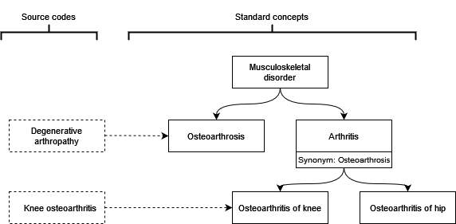
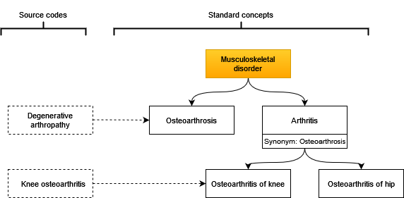
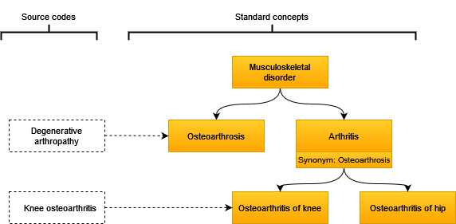
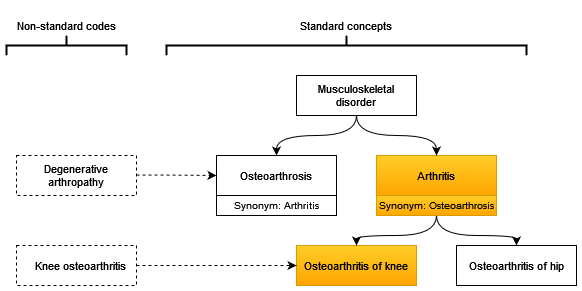
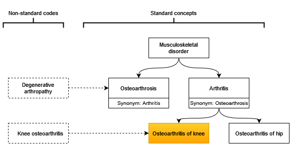
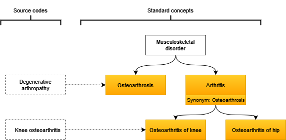
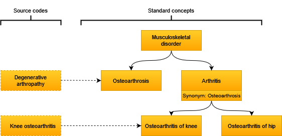

```{r, include = FALSE}
knitr::opts_chunk$set(
  collapse = TRUE,
  comment = "#>"
)
```

## Mock vocabulary database
```{r,  message=FALSE, warning=FALSE,echo=FALSE}
library(DBI)
library(dplyr)
library(dbplyr)
library(here)
library(kableExtra)
library(CodelistGenerator)
library(CDMConnector)
```

Let´s say we have a mock vocabulary database with these hypothetical concepts and relationships.

```{r,echo=FALSE}

```

```{r,  message=FALSE, warning=FALSE,echo=FALSE, results='hide'}
cdm <- mockVocabRef()
```

## Search for exact keyword match 
```{r,echo=FALSE}

```

To find "Musculoskeletal disorder" we can search for that like so 
```{r}
codes <- getCandidateCodes(
  cdm = cdm,
  keywords = "Musculoskeletal disorder",
  domains = "Condition",
  includeDescendants = FALSE,
)

kable(codes)
```

Note, we would also identify it based on a partial match
```{r}
codes <- getCandidateCodes(
  cdm = cdm,
  keywords = "Musculoskeletal",
  domains = "Condition",
  includeDescendants = FALSE
)

kable(codes)
```

## Add descendants
```{r,echo=FALSE}

```

To include descendants of an identified code, we can set includeDescendants to TRUE
```{r}
kable(getCandidateCodes(
  cdm = cdm,
  keywords = "Musculoskeletal disorder",
  domains = "Condition",
  includeDescendants = TRUE
))
```

## Multiple search terms 
We can also search for multiple keywords at the same time, and would have picked these all up with the following search
```{r}
codes <- getCandidateCodes(
  cdm = cdm,
  keywords = c(
    "Musculoskeletal disorder",
    "arthritis",
    "arthrosis"
  ),
  domains = "Condition",
  includeDescendants = FALSE
)

kable(codes)
```

## Add ancestor
```{r, echo=FALSE}

```

To include the ancestors one level above the identified concepts we can set includeAncestor to TRUE

```{r}
codes <- getCandidateCodes(
  cdm = cdm,
  keywords = "Osteoarthritis of knee",
  includeAncestor = TRUE,
  domains = "Condition"
)

kable(codes)
```

## Searches with multiple words
```{r, echo=FALSE}

```

We can also find concepts with multiple words even if they are in a different order. For example, a search for "Knee osteoarthritis" will pick up "Osteoarthritis of knee".

```{r}
codes <- getCandidateCodes(
  cdm = cdm,
  keywords = "Knee osteoarthritis",
  domains = "Condition",
  includeDescendants = TRUE
)

kable(codes)
```


## With exclusions
```{r, echo=FALSE}

```

We can also exclude specific terms 

```{r}
codes <- getCandidateCodes(
  cdm = cdm,
  keywords = "arthritis",
  exclude = "Hip osteoarthritis",
  domains = "Condition"
)

kable(codes)
```

## Search using synonyms
```{r, echo=FALSE}

```

We can also pick up codes based on their synonyms. In this case "Arthritis" has a synonym of "Osteoarthrosis" and so a search of both the primary name of a concept and any of its associated synonyms would pick up this synonym and it would be included.

```{r}
codes <- getCandidateCodes(
  cdm = cdm,
  keywords = "osteoarthrosis",
  domains = "Condition",
  searchInSynonyms = TRUE
)

kable(codes)
```

Or, in this case, we can get the same result by searching via synonyms. In this case when using searchViaSynonyms=TRUE, "Arthritis" (which gets identified first) has a synonym of "Osteoarthrosis", and based on this synonym we can also include the "Osteoarthrosis" concept.

```{r}
codes <- getCandidateCodes(
  cdm = cdm,
  keywords = "arthritis",
  domains = "Condition",
  searchViaSynonyms = TRUE
)

kable(codes)
```

## Fuzzy matches instead of only exact matches 
```{r, echo=FALSE}

```

We could have also picked up "Osteoarthrosis" by doing fuzzy matching which allows for some differences in spelling.

```{r}
codes <- getCandidateCodes(
  cdm = cdm,
  keywords = "arthritis",
  domains = "Condition",
  fuzzyMatch = TRUE,
  maxDistanceCost = 0.2
)

kable(codes)
```

## Search via non-standard
Or we could have also picked up "Osteoarthrosis" by searching via non-standard.

```{r}
codes <- getCandidateCodes(
  cdm = cdm,
  keywords = c("arthritis", "arthropathy"),
  domains = "Condition",
  searchNonStandard = TRUE
)

kable(codes)
```

## Search for both standard and non-standard concepts

```{r, echo=FALSE}

```

We can also include non-standard codes in our results like so

```{r}
codes <- getCandidateCodes(
  cdm = cdm,
  keywords = c(
    "Musculoskeletal disorder",
    "arthritis",
    "arthropathy",
    "arthrosis"
  ),
  domains = "Condition",
  standardConcept = c("Standard", "Non-standard")
)

kable(codes)
```

```{r,echo=FALSE}
DBI::dbDisconnect(attr(cdm, "dbcon"), shutdown = TRUE)
```
