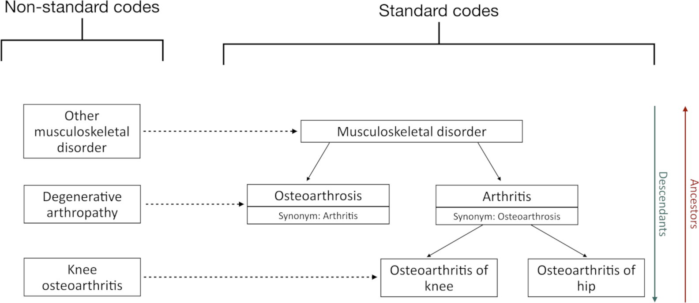

```{r, include = FALSE}
NOT_CRAN <- identical(tolower(Sys.getenv("NOT_CRAN")), "true")

knitr::opts_chunk$set(
  collapse = TRUE,
  comment = "#>",
  out.width = "100%",
  eval = NOT_CRAN
)
```

## Extracting codelists from JSON files
In this vignette, we will explore the functions that help us to generate codelists from JSON files. There are two main types of JSON files we can work with:

-   *Concept sets*: These files usually contain a set of concepts that are grouped together based on a common definition or a clinical meaning. Each concept set may include inclusion/exclusion rules, descendants, and mapping criteria to define the exact scope of concepts included.
-   *Cohorts*: These files define cohorts, which are groups of individuals meeting specific criteria for inclusion in a study. The cohort definitions also include embedded concept sets, logic criteria, time windows, and other metadata needed for cohort construction.

In the following sections, we will explore how to use specific functions to extract the codelists generated by these two type of JSON files. Specifically, we will delve into:

-   `codesFromConceptSet()`: to extract concept IDs directly from a concept set JSON.
-   `codesFromCohort()`: to extract concept IDs from the concept sets embedded within a cohort definition JSON.

Hence, we will start by loading the necessary packages, creating a mock cdm, and saving the mock json files we are going to use to reproduce the example.

```{r, message=FALSE, warning=FALSE}
# Loading necessary files
library(omopgenerics)
library(CodelistGenerator)
library(dplyr)
library(jsonlite)

# Creating mock cdm
cdm <- mockVocabRef()

# Reading mock json files
arthritis_desc <- fromJSON(system.file("concepts_for_mock/arthritis_desc.json", package = "CodelistGenerator")) |> toJSON(pretty = TRUE, auto_unbox = TRUE)
arthritis_no_desc <- fromJSON(system.file("concepts_for_mock/arthritis_no_desc.json", package = "CodelistGenerator")) |> toJSON(pretty = TRUE, auto_unbox = TRUE)
arthritis_with_excluded <- fromJSON(system.file("concepts_for_mock/arthritis_with_excluded.json", package = "CodelistGenerator")) |> toJSON(pretty = TRUE, auto_unbox = TRUE)
arthritis_desc_cohort <- fromJSON(system.file("cohorts_for_mock/oa_desc.json", package = "CodelistGenerator")) |> toJSON(pretty = TRUE, auto_unbox = TRUE)
```

Bear in mind that the structure of the vocabulary in our mock cdm is the following
```{r,echo=FALSE}

```

## Codes from concept sets JSON files
Now, we are going to extract the concept ids provided a concept set JSON file
```{r, message=FALSE, warning=FALSE}
concepts <- codesFromConceptSet(cdm, 
                    path =  system.file(package = "CodelistGenerator","concepts_for_mock"),
                    type = "codelist_with_details")
```

Notice that we have used the argument `type` to define the output as `codelist_with_details`, but we could also obtain a simple `codelist`. Let's have a look at the codelist we have just upload, which contain a set of concept ids to define **arthritis**:
```{r}
concepts
```

### Include descendants
Let's have a look at the first json file, named "arthritis_desc"
```{r}
arthritis_desc
```
Notice that in this codelist, we have `concept_id=3` and `includeDescendants=TRUE`, so the final codelist we have obtained using `codesFromConceptSet()` is

```{r, message=FALSE}
concepts$arthritis_desc
```

Note that `cdm` is one of the arguments because it is used to get the descendants (if needed) the result can vary `cdm` to `cdm` if different vocabulary versions are used.

### Exclude descendants
If descendants are set to exclude in the json file, the function will not provide the descendants:

```{r}
arthritis_no_desc

concepts$arthritis_no_desc
```

### Exclude concepts
It can be that the json file specifies concepts that must be excluded. This will also be taken into account when creating the final codelist using `codesFromConceptSet()`:
```{r}
arthritis_with_excluded

concepts$arthritis_with_excluded
```


## Codes from cohort JSON files
Now, we are going to extract the concept ids provided a cohort JSON file. To do that, we just need to provide the path where we saved the json files:

```{r, message=FALSE, warning=FALSE}
concepts <- codesFromCohort(cdm, 
                    path =  system.file(package = "CodelistGenerator","cohorts_for_mock"),
                    type = "codelist_with_details")
concepts <- newCodelistWithDetails(list("arthritis" = concepts$arthritis))
```

Let's have a look at the codelist we have just upload:
```{r}
arthritis_desc_cohort

concepts$arthritis
```
